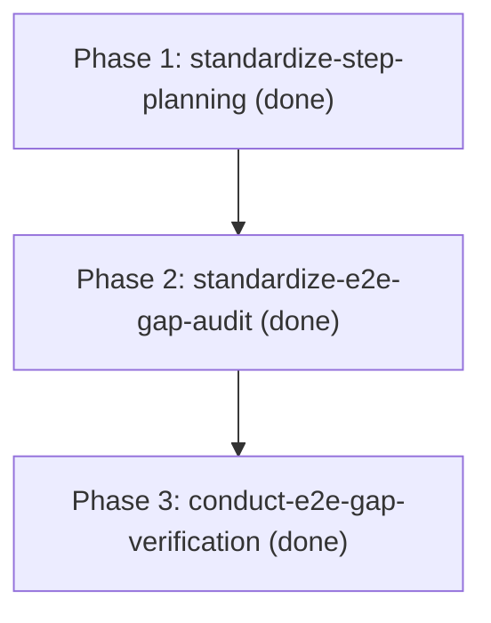

# Phases: Step-Planning Procedures & End-to-End GAP Verification

- **Iteration**: `step-planning-and-e2e-gap`
- **Goal**: Standardize individual step-level micro-planning and holistic end-to-end GAP verification in the Steps protocol, and execute an end-to-end consistency audit.

## Ordered Phases

1. **Phase 1: Standardize Step-Level Micro-Planning Procedure (`P0`)**
   - **ID**: `standardize-step-planning`
   - **Depends on**: `[]`
   - **Owns**: `plugins/steps/procedures/step-planning.md`, `plugins/steps/skills/steps-plan/SKILL.md`, `plugins/steps/skills/steps-implement/SKILL.md`
   - **Gate**: `npm test && npm run render:check`
   - **Status**: `done`

2. **Phase 2: Standardize End-to-End GAP Audit Procedure (`P0`)**
   - **ID**: `standardize-e2e-gap-audit`
   - **Depends on**: `[standardize-step-planning]`
   - **Owns**: `plugins/steps/procedures/e2e-gap-audit.md`, `plugins/steps/skills/gap/SKILL.md`, `plugins/steps/skills/steps/SKILL.md`
   - **Gate**: `npm test && npm run render:check`
   - **Status**: `done`

3. **Phase 3: Conduct End-to-End Verification Audit (`P0`)**
   - **ID**: `conduct-e2e-gap-verification`
   - **Depends on**: `[standardize-e2e-gap-audit]`
   - **Owns**: `.plans/GAPS.md`, `.plans/STATUS.md`, `.plans/ORCHESTRATOR-LOG.md`
   - **Gate**: Complete execution of the E2E GAP procedure, recording verbatim evidence and final sign-off
   - **Status**: `done`

## DAG

