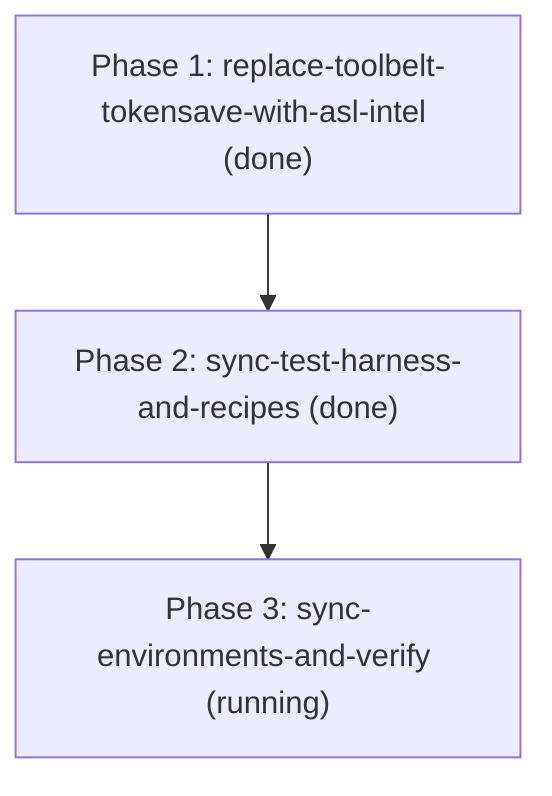

# Phases: Replace TokenSave with ASL-Intel

- **Iteration**: `replace-tokensave-with-asl-intel`
- **Goal**: Replace legacy `tokensave` with native `asl-intel` from GenSEAM ecosystem (`aslang.dev` / `asex`) across `toolbelt`, `pcp`, test fixtures, and harness manifests.

## Ordered Phases

1. **Phase 1: Replace Skill in Toolbelt & Route Code Intelligence (`P0`)**
   - **ID**: `replace-toolbelt-tokensave-with-asl-intel`
   - **Depends on**: `[]`
   - **Owns**: `plugins/toolbelt/skills/tokensave`, `plugins/toolbelt/skills/asl-intel/SKILL.md`, `plugins/toolbelt/skills/search-tools/SKILL.md`, `plugins/pcp/skills/code-intelligence/SKILL.md`, `AGENTS.md`, `plugins/steps/procedures/e2e-gap-audit.md`
   - **Gate**: Zero `tokensave` in `plugins/toolbelt/` and `plugins/pcp/skills/code-intelligence/SKILL.md`
   - **Status**: `done`

2. **Phase 2: Synchronize Test Harness & Recipes (`P0`)**
   - **ID**: `sync-test-harness-and-recipes`
   - **Depends on**: `[replace-toolbelt-tokensave-with-asl-intel]`
   - **Owns**: `tests/fixtures/recipes.mjs`, `tests/fixtures/expected.mjs`, `tests/recipe-exec.test.js`, `tests/install-smoke.sh`, `tests/mutation-harness.mjs`
   - **Gate**: `npm test` exit 0 (86/86 tests, 15/15 self-tests, all recipes execute cleanly)
   - **Status**: `done`

3. **Phase 3: Render Manifests, Environment Sync & Smoke Test (`P0`)**
   - **ID**: `sync-environments-and-verify`
   - **Depends on**: `[sync-test-harness-and-recipes]`
   - **Owns**: `plugins/toolbelt/harnesses/`, `tests/install-smoke.sh`
   - **Gate**: `node plugins/steps/tools/render.mjs --check && bash tests/install-smoke.sh`
   - **Status**: `running`

## DAG

