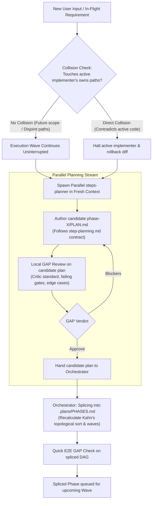

# Steps: Standard Dynamic Planning Procedure (Mid-Flight Ingestion & DAG Splicing)

A standard procedure for ingesting new user inputs, auxiliary tasks, and mid-flight requirements while roadmap execution is actively in progress.

## Why the procedure exists

In real-world workflows, requirements evolve while code is being written. A rigid protocol forces an all-or-nothing choice: either discard active implementation and restart planning from scratch, or ignore user input until the entire roadmap finishes.

This procedure establishes a non-blocking, pipelined mechanism: active implementers continue uninterrupted in their declared ownership zones, while a parallel planning agent ingests the new input, runs GAP validation, and safely splices the new work into the dependency DAG.

---

## 1. Core Architectural Invariants

1. **Single Writer for Roadmap State (`@pcp:c-6307`)**:
   - The parallel planner **never** edits `.plans/PHASES.md`, commits code, or modifies the iteration registry.
   - The parallel planner produces a self-contained candidate plan (`.plans/phase-<id>/PLAN.md` or a structured report) and returns it to the orchestrator.
   - The orchestrator alone reconciles the graph, recalculates topological waves, and writes `.plans/PHASES.md`.

2. **File Ownership Quarantine (`owns`)**:
   - The new phase cannot claim file paths currently owned by active `steps-implementer` agents in the current wave.
   - If a new requirement fundamentally invalidates the files currently being edited, the orchestrator triggers an immediate rollback (`git checkout -- <paths>`) and pauses the affected track.

---

## 2. The Mid-Flight Planning Lifecycle

---

## 3. Step-by-Step Execution Guide

### Step 1: Triage & Collision Assessment
Upon receiving mid-flight input, the orchestrator performs an instant path check:
- Compare target paths against the `owns` declarations of currently running implementers in `STATUS.md`.
- **Case A (Disjoint)**: Target paths belong to future phases or new files. Active workers continue running.
- **Case B (Direct Conflict)**: The input changes the design of code currently in-flight. Immediately stop the conflicting worker, discard uncommitted changes in that sub-tree, and mark that phase `paused`.

### Step 2: Dispatching the Parallel Planner
The orchestrator dispatches a dedicated planning subagent (`steps-planner` or `steps-architect-pro`):
- Provide:
  1. The new user requirement.
  2. The current repository state and architectural decisions in `.pcp/`.
  3. The active `.plans/PHASES.md` DAG.
- The planner writes the candidate `.plans/phase-<id>/PLAN.md` adhering strictly to [`procedures/step-planning.md`](step-planning.md).
- If the new requirement introduces multiple phases or shared primitives, follow [`procedures/plan-synthesis.md`](plan-synthesis.md) to factor foundations into Wave 0 before review.

### Step 3: Local GAP Validation
A clean-context reviewer evaluates the candidate plan:
- **Completeness**: Are boundary values, failing gates, and failure states handled?
- **Invariants**: Does it adhere to active `@pcp:` shortcodes and security rules?
- **Critic Filter**: Is this the minimal working diff, or does it introduce speculative abstractions?
- Verdict is recorded in `.plans/phase-<id>/REVIEW.md`.

### Step 4: DAG Splicing & Topological Sort
When the candidate plan is approved:
1. The orchestrator assigns a unique phase `id`, declares `owns` paths, and identifies `depends_on` links.
2. Splicing logic:
   - If Phase X depends on the output of currently running Phase A: `depends_on: [A]`, scheduled for Wave $N+1$.
   - If Phase X is completely independent of all active and pending phases: scheduled immediately in current or next parallel wave.
3. Kahn's topological sort runs to ensure no cycles are introduced.
4. `.plans/PHASES.md` and `ORCHESTRATOR-LOG.md` are updated.
5. **Live Wave Ingestion**: Updating `.plans/PHASES.md` on disk immediately extends the orchestrator's active execution loop. The orchestrator re-reads the disk state on wave completion, picking up Phase X for speculative planning or execution without requiring an orchestrator restart.

### Step 5: Cross-Cutting E2E Verification & Consistency Check
Before dispatching any spliced or updated phase, the orchestrator/reviewer executes a bidirectional consistency pass:
1. **Backward Check (Past Phases 1..N-1)**:
   - Does the new requirement contradict or regress code already implemented and committed in earlier phases?
   - If backward incompatibilities arise, immediately schedule an atomic adaptation micro-phase rather than modifying past phases ad-hoc.
2. **Forward Check (Future Phases N+1..End)**:
   - Do downstream phases have clean contracts aligned with the new slice?
   - Verify zero dangling dependencies, zero duplicate schemas/types, and zero ownership collisions.
3. **Cross-Cutting GAP Validation**:
   - Run a focused E2E GAP check (`.plans/GAPS.md`) following [`procedures/e2e-gap-audit.md`](e2e-gap-audit.md) to guarantee whole-system coherence.

---

## 4. Done When

The new phase plan satisfies the step-planning contract, passed its local GAP review, successfully passed the bidirectional cross-cutting E2E check, is cleanly spliced into `.plans/PHASES.md` without ownership collisions or cyclic dependencies, and is queued into the wave schedule.
