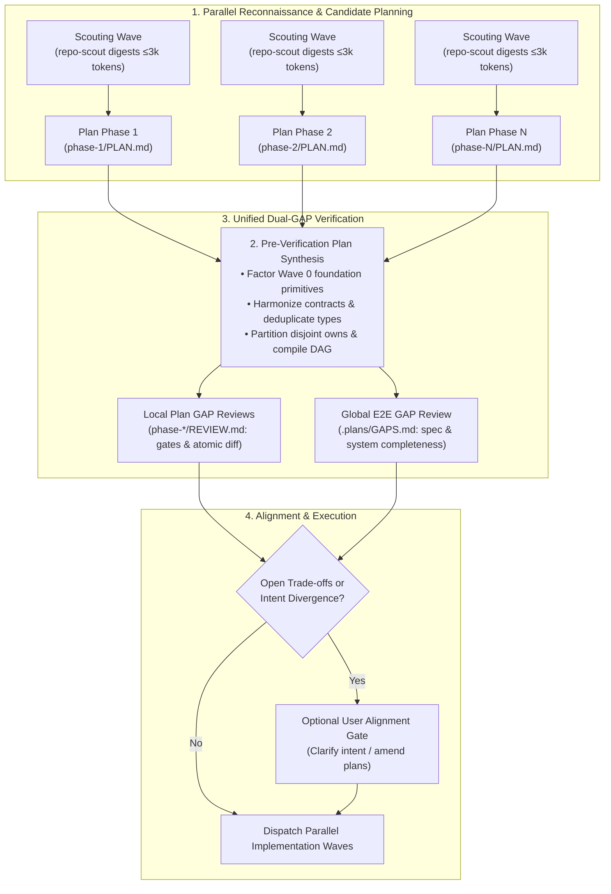

# Steps: Standard End-to-End GAP Audit Procedure

A standard procedure for executing a holistic, cross-cutting GAP audit across all roadmap phases and the entire codebase.

## Why the procedure exists

Local phase reviews (`REVIEW.md` and `IMPL-REVIEW.md`) inspect changes in isolation. They can pass cleanly while global defects accumulate:
1. **Inter-phase omissions**: Requirements that fall between the cracks of two disjoint phase boundaries.
2. **Specification drift**: Omission of endpoints, security invariants, or domain constraints declared in the task specification or `.pcp/`.
3. **Orphaned abstractions**: Helper utilities, dead branches, or redundant schemas introduced during intermediate phases that no longer serve any active code.
4. **Regressions & whole-system breakage**: A change in an early phase that breaks assumptions in a downstream module not covered by that phase's isolated gate.

---

## 1. The Pre-Flight Planning & Dual-GAP Pipeline (Batch Ahead)

Before any code is written in a multi-phase roadmap, execution follows a unified reconnaissance, synthesis, and dual-GAP validation process:

### Pre-Flight Principle: Shift-Left Intent Clarification
Clarification with the user follows a strict boundary rule:
- **Codebase & Knowledge Questions (Self-Service)**: Any question regarding how the codebase functions, existing dependencies, architecture, or data models must be answered autonomously via code intelligence (`asl-intel`), AST inspection, and `.pcp/`. Never ask the user questions the codebase already answers.
- **Intent & Desired Outcome Ambiguities (Shift-Left)**: If the incoming prompt has genuine ambiguity regarding business intent, target behavior, or conflicting desired outcomes, ask immediately at intake. Resolving fundamental intent upfront avoids wasting planning cycles on the wrong problem.

---

### Step 1: Parallel Reconnaissance & Candidate Planning
- Dispatch 1–3 `repo-scout` agents across distinct boundaries (domain, coupling, infrastructure), each returning a compact Context Digest (≤ 3k tokens).
- Each phase is planned concurrently by `steps-planner` (or `steps-architect-pro` for Tier 2) in its own fresh context.
- Planners author candidate `phase-i/PLAN.md` adhering strictly to [`procedures/step-planning.md`](step-planning.md), defining atomic work items (15–50 LOC) with explicit failing gates.

### Step 2: Pre-Verification Plan Synthesis (Cross-Phase Conceptual Synthesis)
The orchestrator/architect conducts cross-phase synthesis following [`procedures/plan-synthesis.md`](plan-synthesis.md) **before** submitting plans to final GAP review:
1. **Shared Primitives & Types**: Ensures no duplicate data models or conflicting utilities across phases. Factors common dependencies into a prerequisite foundation micro-phase (Wave 0).
2. **Producer-Consumer Contracts**: Verifies that the outputs and schemas of Phase A directly align with the inputs and imports expected by Phase B.
3. **DAG & Ownership Alignment**: Locks the topological sort DAG (`depends_on`) and guarantees strictly disjoint file paths (`owns`) across candidate parallel phases.
4. **Harmonized Plan Emit**: Updates candidate `phase-*/PLAN.md` and `.plans/PHASES.md` with synthesized contracts and partitioned boundaries.

### Step 3: Unified Dual-GAP Verification Stage
With the synthesized roadmap and harmonized plans emitted, reviewers grade the complete system in clean contexts:
1. **Local Plan GAP Gate (`phase-i/REVIEW.md`)**:
   - Clean-context reviewer runs `gap` on each synthesized `phase-i/PLAN.md`.
   - Evaluates: item completeness, edge-case coverage within the phase, gate reproducibility, and Critic anti-bloat filtering.
   - Verdict recorded in `phase-i/REVIEW.md`. Blocker findings return to the phase planner for complete rewrite before proceeding.
2. **Global E2E GAP Gate (`.plans/GAPS.md`)**:
   - A fresh-context reviewer conducts a holistic GAP review across all consolidated phase plans together:
   - **Spec Traceability**: Verifies 100% coverage of task requirements, user goals, and `.pcp/` architectural decisions across the combined plan.
   - **Cross-Boundary Omissions**: Detects missing migrations, initialization sequences, or unhandled failure flows between phases.
   - **Global Over-Engineering Filter**: Verifies that the combined architecture maintains the Critic standard (simplest working system, zero speculative layers).
   - **Proactive Opportunity Discovery**: Identifies high-value complementary capabilities (e.g. edge-case resilience, auxiliary observability, developer tooling, logically adjacent features) uncovered during planning, recorded as non-blocking suggestions for future phases.
   - **Sign-Off**: Emits `.plans/GAPS.md`. Verdict `approve` unlocks execution; `reject` returns cross-phase blockers to Step 2.

### Step 4: Optional User Alignment Gate & Re-GAP Loop
An optional, high-leverage alignment point triggered **after** the GAP review:
- **Trigger**: Run **only** when the Global GAP audit or phase synthesis surfaces:
  1. Open business, UX, or design trade-offs that cannot be safely determined autonomously.
  2. A material divergence between the user's initial prompt and what the technical GAP analysis discovered.
  3. Non-trivial architectural compromises (e.g. deprecations, breaking changes, scope adjustments).
  4. Proactive suggestions that could warrant immediate inclusion in the active roadmap.
- **Execution & Re-GAP Loop**:
  1. Present the user with a concise summary of the plan, stating the protocol baseline defaults:
     - **Scope**: Full execution of all phases across the roadmap.
     - **Concurrency**: Maximum parallelism across independent waves.
     - **Commits**: Commits on every verified phase (or per verified item gate).
  2. Ask for alignment (surfacing any proactive opportunities):
     > *"Default plan: Full execution of all phases with maximum parallelism and commits per phase. Proactive suggestions identified: [Phase N+1: X, Phase N+2: Y]. Reply 'OK' to proceed with defaults, or specify which suggestions to incorporate."*
  3. **OK Confirmation**: An "OK" reply confirms the baseline — execute all phases continuously across waves without intermediate pauses between completed phases until the entire roadmap finishes.
  4. **Plan Amendment**: If the user requests overrides or accepts suggestions, update `PHASES.md` and relevant `phase-N/PLAN.md` files.
  5. **Final Re-GAP Check**: If amended, re-run the global GAP pass to guarantee the adjustments introduced no new omissions or architectural drift before dispatching implementation waves.
- **Auto-Bypass**: If the GAP review finds no open user-level ambiguities and no immediate suggestions are accepted, proceed directly to implementation under the baseline defaults.

---

## 2. Post-Execution GAP Audit (Sign-Off & Archive)

Conducted after all phases in the roadmap are implemented and verified, prior to iteration archiving:
1. **Holistic Verification Gate**:
   - Run the full repository verification command (`npm test` or `constitution.verification_command`).
   - Confirm exit code 0 across all unit, integration, and guard test suites.
2. **Architectural Invariant Audit**:
   - Inspect conformance with active ADRs (`@pcp:d-xxxx`) and engineering caveats (`@pcp:c-xxxx`).
   - Check for zero-comment compliance: no descriptive or workaround commentary in source code.
3. **Orphan & Dead-Code Inspection**:
   - Scan for unused variables, unreferenced files, orphaned types, or dead configuration branches.
4. **Critic Filter (Anti-Overengineering Check)**:
   - Verify that all newly added code represents the shortest working diff.
   - Prune any speculative generalizations, unused wrappers, or redundant dependencies.
5. **Proactive Horizons & Retrospective Proposals**:
   - Inspect patterns, abstractions, and domain discoveries revealed during actual implementation.
   - Propose high-leverage follow-up phases, technical debt reductions, or optimizations for subsequent iterations.
   - Record concrete suggestions under `## Proactive Suggestions & Next Iteration Proposals` in `.plans/GAPS.md`.

---

## 3. Deliverable: `.plans/GAPS.md`

The procedure produces or updates `.plans/GAPS.md` containing:
- **Verdict**: Exactly one of `approve`, `approve-with-amendments`, or `reject`.
- **Evidence Table**: Verification results and commands executed.
- **Findings Inventory**: Categorized by severity (High, Medium, Low) with verbatim `path:line` citations.
- **Remediation Plan**: Prioritized corrective actions for any identified gaps.
- **Proactive Suggestions & Next Horizons**: Concrete follow-up proposals, architectural hardening, or subsequent iteration candidates uncovered during planning and execution.

### 3.1. Visual Signal Taxonomy (Clean Indicator Standards)

To guarantee instant visual scannability across reports, logs, and chat summaries without emoji noise, use this strict, minimalist indicator taxonomy:

| Indicator | Category | Meaning & Context |
|---|---|---|
| `✅` | **Verdicts & Gates** | Clean pass, approved plan/diff, gate green, zero blockers. |
| `⚠️` | **Verdicts & Gates** | Conditional approval, approved-with-amendments, minor warning. |
| `🛑` | **Verdicts & Gates** | Plan reject, implementation blocker, gate failed, spec breach. |
| `🆕` | **Scope & DAG** | Mid-flight spliced phase, newly discovered step on disk, dynamic scope extension. |
| `💡` | **Opportunities** | Proactive suggestion, latent capability discovered, future phase proposal. |
| `⚡` | **Pipelining** | Speculative hit, instant wave handover, zero turnaround latency transition. |
| `🚨` | **Escalation** | Circuit-breaker triggered, rollback invoked, tier climbing (`hidden-coupling`). |
| `🔒` | **Invariants** | Constitutional rule, ADR constraint (`@pcp:d-xxxx`), strict security policy. |
| `🧭` | **Reconnaissance** | Scouting digest, AST exploration, call-graph boundary discovery. |

---

## 4. Done When

`.plans/GAPS.md` exists with an `approve` or `approve-with-amendments` verdict, all critical blockers are remediated, the whole test suite is green, and the orchestrator records final sign-off in `STATUS.md`.
