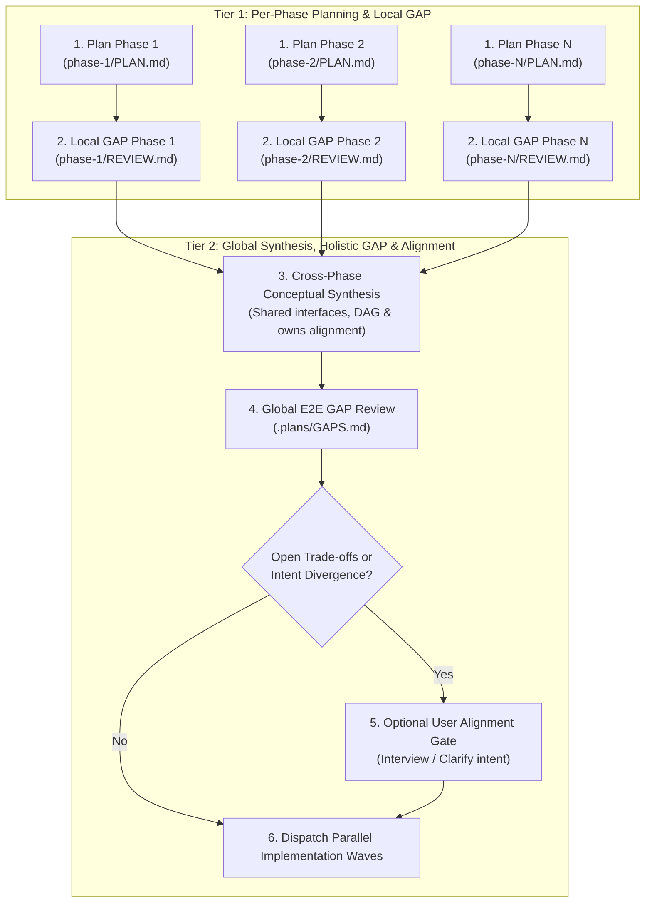

# Steps: Standard End-to-End GAP Audit Procedure

A standard procedure for executing a holistic, cross-cutting GAP audit across all roadmap phases and the entire codebase.

## Why the procedure exists

Local phase reviews (`REVIEW.md` and `IMPL-REVIEW.md`) inspect changes in isolation. They can pass cleanly while global defects accumulate:
1. **Inter-phase omissions**: Requirements that fall between the cracks of two disjoint phase boundaries.
2. **Specification drift**: Omission of endpoints, security invariants, or domain constraints declared in `ai-docs/specs/` or `ai-docs/constitution.yaml`.
3. **Orphaned abstractions**: Helper utilities, dead branches, or redundant schemas introduced during intermediate phases that no longer serve any active code.
4. **Regressions & whole-system breakage**: A change in an early phase that breaks assumptions in a downstream module not covered by that phase's isolated gate.

---

## 1. The Pre-Flight Planning & Dual-GAP Pipeline (Batch Ahead)

Before any code is written in a multi-phase roadmap, execution follows a two-tier planning and dual-GAP validation process:

### Pre-Flight Principle: Shift-Left Intent Clarification
Clarification with the user follows a strict boundary rule:
- **Codebase & Knowledge Questions (Self-Service)**: Any question regarding how the codebase functions, existing dependencies, architecture, or data models must be answered autonomously via code intelligence (`tokensave`, `asl-intel`), AST inspection, and `ai-docs/`. Never ask the user questions the codebase already answers.
- **Intent & Desired Outcome Ambiguities (Shift-Left)**: If the incoming prompt has genuine ambiguity regarding business intent, target behavior, or conflicting desired outcomes, ask immediately at intake. Resolving fundamental intent upfront avoids wasting planning cycles on the wrong problem.

---

### Step 1: Per-Phase Planning
- Each phase is planned independently by `steps-planner` (or `steps-architect-pro` for Tier 2).
- Authors `phase-i/PLAN.md` following [`procedures/step-planning.md`](step-planning.md) with atomic work items and failing gates.

### Step 2: Per-Phase Local GAP Gate
- Clean-context reviewer runs `gap` on `phase-i/PLAN.md`.
- Evaluates: item completeness, edge-case coverage within the phase, gate reproducibility, and Critic anti-bloat filtering.
- Verdict recorded in `phase-i/REVIEW.md`. Blocker findings return to the phase planner for complete rewrite before proceeding.

### Step 3: Cross-Phase Conceptual Synthesis (Holistic Planning)
Once all phase plans pass their local GAP reviews, the orchestrator/architect conducts cross-phase synthesis:
1. **Shared Primitives & Types**: Ensures no duplicate data models or conflicting utilities across phases. Factors common dependencies into a prerequisite micro-phase (Wave 0).
2. **Inter-Phase Contracts**: Verifies that the outputs and schemas of Phase A directly align with the inputs expected by Phase B.
3. **DAG & Ownership Alignment**: Locks the topological sort DAG (`depends_on`) and guarantees strictly disjoint file paths (`owns`) across candidate parallel phases.
4. Writes updated graph and contracts to `.plans/PHASES.md`.

### Step 4: Global E2E GAP Gate
A fresh-context reviewer conducts a holistic GAP review across all consolidated phase plans together:
1. **Spec Traceability**: Verifies 100% coverage of `ai-docs/specs/` and `ai-docs/constitution.yaml` requirements across the combined plan.
2. **Cross-Boundary Omissions**: Detects missing migrations, initialization sequences, or unhandled failure flows between phases.
3. **Global Over-Engineering Filter**: Verifies that the combined architecture maintains the Critic standard (simplest working system, zero speculative layers).
4. **Sign-Off**: Emits `.plans/GAPS.md`. Verdict `approve` unlocks execution; `reject` returns cross-phase blockers to Step 3.

### Step 5: Optional User Alignment Gate & Re-GAP Loop
An optional, high-leverage alignment point triggered **after** the GAP review:
- **Trigger**: Run **only** when the Global GAP audit or phase synthesis surfaces:
  1. Open business, UX, or design trade-offs that cannot be safely determined autonomously.
  2. A material divergence between the user's initial prompt and what the technical GAP analysis discovered.
  3. Non-trivial architectural compromises (e.g. deprecations, breaking changes, scope adjustments).
- **Execution & Re-GAP Loop**:
  1. Present the user with a concise summary of the plan, highlighting the specific trade-off and recommendation.
  2. Collect user alignment.
  3. **Plan Amendment**: Update `PHASES.md` and relevant `phase-N/PLAN.md` files to reflect the agreed decision.
  4. **Final Re-GAP Check**: Re-run the global GAP pass on the amended plan to guarantee that user-requested adjustments introduced no new omissions or architectural drift.
  5. Only after a clean re-GAP sign-off does the orchestrator dispatch implementation waves.
- **Auto-Bypass**: If the GAP review finds no open user-level ambiguities, proceed directly to implementation without asking for intermediate confirmation.

---

## 2. Post-Execution GAP Audit (Sign-Off & Archive)

Conducted after all phases in the roadmap are implemented and verified, prior to iteration archiving:
1. **Holistic Verification Gate**:
   - Run the full repository verification command (`npm test` or `constitution.verification_command`).
   - Confirm exit code 0 across all unit, integration, and guard test suites.
2. **Architectural Invariant Audit**:
   - Inspect conformance with active ADRs (`@pcp:d-xxxx`) and engineering caveats (`@pcp:c-xxxx`).
   - Check for zero-comment compliance: no descriptive or workaround commentary in source code.
3. **Orphan & Dead-Code Inspection**:
   - Scan for unused variables, unreferenced files, orphaned types, or dead configuration branches.
4. **Critic Filter (Anti-Overengineering Check)**:
   - Verify that all newly added code represents the shortest working diff.
   - Prune any speculative generalizations, unused wrappers, or redundant dependencies.

---

## 3. Deliverable: `.plans/GAPS.md`

The procedure produces or updates `.plans/GAPS.md` containing:
- **Verdict**: Exactly one of `approve`, `approve-with-amendments`, or `reject`.
- **Evidence Table**: Verification results and commands executed.
- **Findings Inventory**: Categorized by severity (High, Medium, Low) with verbatim `path:line` citations.
- **Remediation Plan**: Prioritized corrective actions for any identified gaps.

---

## 4. Done When

`.plans/GAPS.md` exists with an `approve` or `approve-with-amendments` verdict, all critical blockers are remediated, the whole test suite is green, and the orchestrator records final sign-off in `STATUS.md`.
