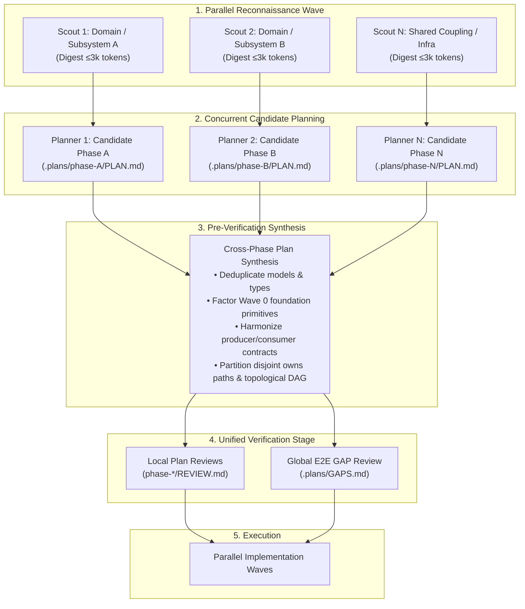

# Steps: Standard Parallel Reconnaissance & Plan Synthesis Procedure

A standard procedure for parallel multi-domain scouting, concurrent candidate planning, and pre-verification cross-phase synthesis.

## Why the procedure exists

Planning multi-phase roadmaps one phase at a time serially is slow. However, dispatching parallel planners across multiple phases without coordination causes severe architectural defects:
1. **Duplicate Abstractions**: Parallel planners independently invent duplicate data models, helper functions, and schemas for the same domain concepts.
2. **Contract Mismatches**: Phase A's planned outputs (function signatures, return types, payload schemas) do not align with Phase B's planned inputs.
3. **Ownership Collisions**: Independent planners claim the same shared files in their `owns` declarations, creating merge conflicts and breaking parallel wave execution.
4. **Verification Churn**: Running reviews on isolated plans before cross-phase synthesis results in wasted review cycles when synthesis subsequently alters interfaces and structures.

This procedure establishes an optimized 4-stage pipeline: **Parallel Scouting ➔ Parallel Planning ➔ Pre-Verification Synthesis ➔ Unified GAP Verification**.

---

## 1. Core Architectural Invariants

1. **Single Synthesizer Authority (`@pcp:c-6307`)**:
   - Parallel planners produce self-contained candidate plans in `.plans/phase-<id>/PLAN.md`.
   - The orchestrator (or `steps-architect-pro`) alone performs cross-phase synthesis, factors shared primitives, and writes `.plans/PHASES.md`.

2. **Shared Foundation Factoring (The Wave 0 Rule)**:
   - Shared data models, type definitions, and core utility functions required by multiple phases cannot be implemented concurrently in parallel tracks.
   - All shared primitives must be factored out into a prerequisite foundation phase (`phase-0-scaffold` or `phase-foundation`) scheduled in Wave 0.

3. **Disjoint Ownership Enforcement**:
   - No two phases scheduled in the same parallel execution wave may share any paths in their `owns` lists. Overlapping files require dependency serialization or extraction into Wave 0.

4. **Synthesis Precedes Final Verification**:
   - Cross-phase contract harmonization, type deduplication, and ownership partitioning occur **before** submitting plans to final GAP review, ensuring reviewers grade the actual synthesized system.

---

## 2. The Scouting, Planning & Synthesis Lifecycle

---

## 3. Step-by-Step Execution Guide

### Step 1: Parallel Reconnaissance Wave
When a multi-phase feature or roadmap is initiated, the orchestrator dispatches a parallel scouting wave:
- Assign 1–3 `repo-scout` agents across distinct boundaries:
  - By domain/subsystem (e.g. auth layer vs. database models vs. API endpoints).
  - By architectural question (e.g. existing patterns vs. cross-module coupling vs. external dependencies).
- Each scout inspects the codebase read-only and returns a compact Context Digest (strictly ≤ 3k tokens) identifying target files, existing interfaces, data flow, and reusable utilities.

### Step 2: Concurrent Candidate Planning Stream
With scouting digests in hand, the orchestrator dispatches parallel planners (`steps-planner` or `steps-architect-pro`):
- Each planner is assigned a candidate phase with its specific goal, scout digest, and acceptance criterion.
- Planners draft candidate plans adhering to [`procedures/step-planning.md`](step-planning.md), specifying atomic work items, target files, and failing gate commands.
- Planners do not touch other phase directories or application code.

### Step 3: Pre-Verification Synthesis Stage
The orchestrator (or `steps-architect-pro`) receives all candidate phase plans and performs cross-phase synthesis before review:
1. **Model & Schema Deduplication**:
   - Compare proposed schemas across plans. If Phase A and Phase B both define a user token or payload interface, consolidate them into a single canonical definition.
2. **Wave 0 Factoring**:
   - Extract shared types, interfaces, and base configuration into a dedicated prerequisite micro-phase (e.g. `phase-0-scaffold`), scheduled in Wave 0.
3. **Producer-Consumer Contract Harmonization**:
   - Verify that output signatures produced by upstream phases exactly match the inputs and imports expected by downstream phases.
4. **Ownership Partitioning & DAG Compilation**:
   - Ensure strictly disjoint file paths in `owns` declarations across phases scheduled in the same wave.
   - Run Kahn's topological sort on `depends_on` links to produce the wave execution schedule in `.plans/PHASES.md`.
5. **Harmonized Plan Emit**:
   - Update candidate `phase-*/PLAN.md` files to reference the synthesized contracts and shared primitives.
6. **Proactive Opportunity Inventory**:
   - Capture auxiliary capabilities, extension points, or hardening ideas discovered during synthesis that exceed the immediate scope into a non-blocking follow-up list for GAP review.

### Step 4: Unified Verification Gate
The synthesized plans are submitted to clean-context review:
1. **Local Plan Reviews**:
   - `steps-plan-reviewer` validates each phase's items, atomic complexity sizing (15–50 lines per item), and failing gates.
2. **Global E2E GAP Review**:
   - Reviewer runs `procedures/e2e-gap-audit.md` across all consolidated plans to ensure zero omissions, complete specification coverage, anti-overengineering compliance, and proactive follow-up proposals.
   - Emits `.plans/GAPS.md`.
3. **Execution Unblock & Continuous Drive**:
   - On `approve`, the orchestrator immediately launches execution under maximum parallelism across the synthesized waves.
   - Execution drives continuously across waves with immediate handovers until the entire roadmap is done or a hard block occurs; intermediate user permissions are never requested between completed waves.

---

## 4. Done When

Scouting digests are distilled, candidate plans are synthesized into a coherent DAG with zero duplicate schemas and strictly disjoint `owns` paths, shared primitives are factored into Wave 0, and synthesized plans pass both local and global GAP verification.
