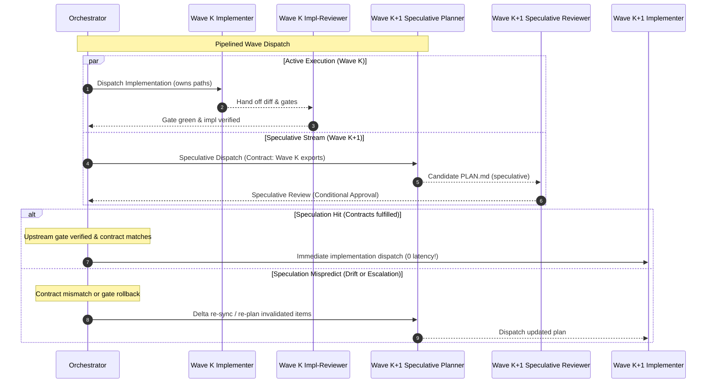

# Steps: Standard Speculative Planning & Pipelining Procedure

A standard procedure for overlapping wave execution with speculative planning and plan review of upcoming phases.

## Why the procedure exists

Serial roadmap execution introduces significant turnaround latency between dependency waves: when Wave $K$ finishes writing code and passes its gate, workers sit idle while the orchestrator dispatches a planner, waits for `PLAN.md`, runs a plan review, and only then starts Wave $K+1$.

This procedure establishes a pipelined, speculative execution model: while Wave $K$ implementers are actively writing code in their declared `owns` zones, an isolated speculative planning stream prepares and reviews the candidate plan for Wave $K+1$ anchored on declared upstream interface contracts. When Wave $K$ passes its gate, Wave $K+1$ is already planned and reviewed, transitioning to implementation with zero turnaround latency.

---

## 1. Core Architectural Invariants

1. **Speculation is Read/Plan Only (`@pcp:c-6307`)**:
   - Speculative subagents (`repo-scout`, `steps-planner`, `steps-architect-pro`, `steps-plan-reviewer`) operate strictly in read-only mode regarding application source code.
   - Speculative agents **never** write application code, edit uncommitted worktrees, or touch files claimed by active implementers' `owns` paths.
   - Code writing (`steps-implementer`) is **never** speculative; it begins only after upstream dependency gates are green and committed.

2. **Upstream Interface Contract Anchor**:
   - Speculative planning is anchored on explicit upstream contract declarations (exported symbol signatures, data schemas, API routes) rather than guesswork.
   - The candidate plan records its assumed upstream contracts in its header (`speculative_contract: [<upstream-phase-ids>]`).

3. **Single Writer for Roadmap State**:
   - Speculative agents write candidate plans only into `.plans/phase-<id>/`.
   - The orchestrator alone evaluates contract fulfillment, updates `.plans/PHASES.md`, and unblocks execution.

4. **Continuous Pipelining Drive (Zero-Pause Wave Handover)**:
   - Once roadmap execution begins, the orchestrator drives continuously across waves until the entire roadmap is done.
   - When Wave K passes its gate and review, the orchestrator never halts to seek intermediate user permission. It immediately commits Wave K diff, promotes Wave K+1 to active implementation in the same turn, and dispatches Wave K+2 speculative planning. Only hard blocks or gate failures pause execution.

5. **Living Roadmap & Dynamic Disk Scope**:
   - The execution scope is not frozen at initial launch. The roadmap is a living graph on disk (`.plans/PHASES.md`).
   - At every wave transition, the orchestrator re-reads `.plans/PHASES.md` on disk.
   - If new phases or steps were appended or spliced in mid-flight (via `procedures/dynamic-planning.md`, user edits, or accepted proactive suggestions), the pipeline automatically extends:
     - Even if the orchestrator was executing what was previously the final phase, discovering newly unblocked phases on disk immediately launches speculative planning (or active implementation) for them.
     - Execution terminates only when **every** phase declared on disk in `.plans/PHASES.md` is verified and marked `done`.

---

## 2. The Pipelining Lifecycle

---

## 3. Step-by-Step Execution Guide

### Step 1: Contract Anchoring at Wave Dispatch
When dispatching Wave $K$ implementation, the orchestrator identifies candidate phases for Wave $K+1$:
- Identify the explicit interface boundary produced by Wave $K$ (e.g. `src/auth/token.js:verifyToken`, API route schemas, or database types).
- Define the contract assumptions that Wave $K+1$ requires.

### Step 2: Dispatching the Speculative Stream
In the same turn that launches Wave $K$ workers, the orchestrator dispatches the Wave $K+1$ planning stream:
- Dispatch `repo-scout` (if needed) for deep exploration of Wave $K+1$ target files.
- Dispatch `steps-planner` with:
  1. The target phase goal and acceptance criterion.
  2. The current repository state on disk.
  3. The declared interface contract promise of Wave $K$.
- The planner writes `.plans/phase-<id>/PLAN.md` with explicit work items following [`procedures/step-planning.md`](step-planning.md) and notes:
  `speculative_contract: [phase-<k>]`.

### Step 3: Speculative Plan Review (Conditional Approval)
A clean-context `steps-plan-reviewer` evaluates the candidate plan:
- **Contract Conformance**: Does the plan correctly consume the declared interface contract of Wave $K$?
- **Critic & GAP Standards**: Does each item define an atomic diff, boundary conditions, and a reproducible gate?
- **Conditional Verdict**: If complete, the reviewer marks the plan `approved (conditional on upstream contract verification)`.

### Step 4: Verification Pre-Flighting
While Wave $K$ implementation finishes:
- The planner or scout verifies that gate commands for Wave $K+1$ fail predictably against current code (satisfying the failing-gate requirement).
- Any synthetic fixtures or test mocks can be staged in read-only analysis.

### Step 5: Speculation Resolution & Instant Wave Handover
When Wave $K$ implementation finishes and passes its verification gate:
1. **Speculation Hit (Contract Met)**:
   - The orchestrator confirms that Wave $K$'s committed code satisfies the declared interface contract.
   - The conditional approval on `.plans/phase-<id>/PLAN.md` becomes final.
   - The orchestrator commits Wave $K$ diff (`git add <owns>`), updates `.plans/STATUS.md`, and unblocks Wave $K+1$.
   - `steps-implementer` is dispatched for Wave $K+1$ **immediately in the exact same turn**, with zero turns lost to planning and zero intermediate pauses.
   - If a subsequent Wave $K+2$ exists in the DAG, dispatch its speculative planning stream concurrently.
2. **Speculation Mispredict (Interface Drift or Escalation)**:
   - If Wave $K$ escalated (`hidden-coupling`, rollback) or altered the expected signature/schema:
   - The orchestrator marks the speculative plan for delta re-sync.
   - `steps-planner` is re-dispatched with only the delta difference. Because the scout digest and 80%+ of the plan structure remain valid, re-planning finishes in a single fast turn.
3. **Continuous Execution & Dynamic Scope Ingestion**:
   - At each wave transition, the orchestrator re-reads `.plans/PHASES.md` on disk to ingest newly added phases or mid-flight requirements.
   - If new phases were added to the DAG while Wave $K$ was executing (even if Wave $K$ was originally planned as the final wave), the orchestrator dynamically extends the pipeline: Wave $K+1$ implements, Wave $K+2$ begins speculative planning.
   - Execution never pauses between completed waves to query user permission, and halts only when every phase in `.plans/PHASES.md` on disk is marked `done` or if a hard block triggers.

---

## 4. Done When

The candidate plan adheres to the step-planning contract, passed its speculative GAP review, has its assumed contracts validated against the green upstream implementation, and is promoted directly to active execution without ownership conflicts.
