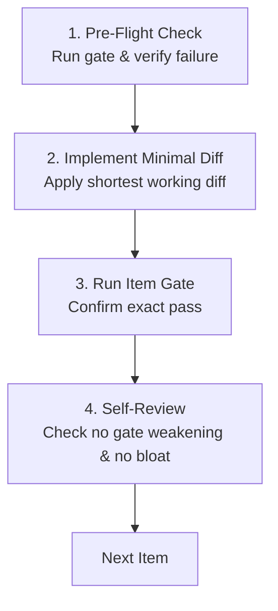

# Steps: Standard Step-Planning Procedure

A standard procedure for planning, pre-flighting, and executing each individual work item (step) within a phase.

## Why the procedure exists

A phase plan that lists vague tasks ("update auth module", "fix tests") leaves execution unconstrained. Without a step-level contract, implementers write speculative abstractions, miss boundary conditions, and test only after all files are modified.

This procedure enforces that every individual step is an atomic, pre-flighted unit of work with an explicit failing gate, minimal diff scope, and zero guesswork.

---

## 1. Step Definition Contract

When the planner (`steps-planner` or `steps-architect-pro`) writes an item in `PLAN.md`, it must specify:

1. **Exact Target**:
   - Explicit file paths and code symbols (`path/to/file.js:symbolName` or `path/to/file.py:L10-L40`).
   - Never vague descriptions or wildcard directories without path boundaries.

2. **Preconditions & Invariants**:
   - Prerequisites from prior steps that must hold before this step begins.
   - Core invariants (e.g. security rules, zero-comment shortcodes `@pcp:`) that cannot be breached.

3. **Failing Gate Command**:
   - The literal, reproducible command that fails **before** the step is executed.
   - The verbatim current failure output recorded in the plan as proof that the gate is able to fail.

4. **Minimum Working Diff Boundary (Critic Standard)**:
   - The shortest working diff that completely solves the item's requirement.
   - Anti-overengineering constraint: reuse existing utilities, standard library functions over new dependencies, no premature abstractions.

5. **Edge Cases & Failure Modes**:
   - Explicit inventory of boundary conditions: null/undefined states, empty collections, timeouts, invalid payloads, network disconnects.

---

## 2. Implementer Pre-Flight & Execution Loop

When `steps-implementer` takes an item from `PLAN.md`:

1. **Pre-Flight Check**:
   - Run the item's declared gate command read-only.
   - Verify that it fails with the expected error. If it already passes, report immediately: a pass before code indicates a tautological test.

2. **Implement Minimal Diff**:
   - Apply only the changes strictly needed for the item.
   - Respect file ownership boundaries (`owns`).

3. **Verify Gate**:
   - Run the item's gate command. It must exit 0 cleanly.

4. **Self-Review**:
   - Inspect the diff: did it introduce speculative code or comments?
   - Did it weaken any assertion, broaden any regex, or skip any existing test? (Never weaken a gate).

5. **Escalate when Blocked**:
   - If two distinct fixes fail or unforeseen coupling is discovered, halt and trigger `hidden-coupling` rather than continuing to iterate.

---

## 3. Done When

Every item in the phase plan satisfies the contract, its pre-flight check confirmed initial failure, its implementation produced the shortest working diff, and its gate passed cleanly.
