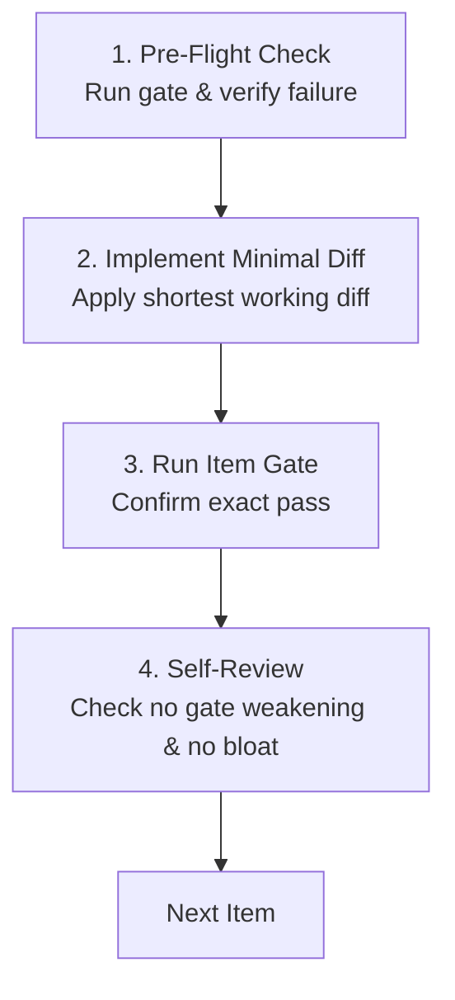

# Steps: Standard Step-Planning Procedure

A standard procedure for planning, pre-flighting, and executing each individual work item (step) within a phase.

## Why the procedure exists

A phase plan that lists vague tasks ("update auth module", "fix tests") leaves execution unconstrained. Without a step-level contract, implementers write speculative abstractions, miss boundary conditions, and test only after all files are modified.

This procedure enforces that every individual step is an atomic, pre-flighted unit of work with an explicit failing gate, minimal diff scope, and zero guesswork.

---

## 1. Step Definition Contract

When the planner (`steps-planner` or `steps-architect-pro`) writes an item in `PLAN.md`, it must specify:

1. **Exact Target**:
   - Explicit file paths and code symbols (`path/to/file.js:symbolName` or `path/to/file.py:L10-L40`).
   - Never vague descriptions or wildcard directories without path boundaries.

2. **Preconditions & Invariants**:
   - Prerequisites from prior steps that must hold before this step begins.
   - Core invariants (e.g. security rules, zero-comment shortcodes `@pcp:`) that cannot be breached.

3. **Failing Gate Command**:
   - The literal, reproducible command that fails **before** the step is executed.
   - The verbatim current failure output recorded in the plan as proof that the gate is able to fail.

4. **Minimum Working Diff Boundary (Critic Standard)**:
   - The shortest working diff that completely solves the item's requirement.
   - Anti-overengineering constraint: reuse existing utilities, standard library functions over new dependencies, no premature abstractions.

5. **Edge Cases & Failure Modes**:
   - Explicit inventory of boundary conditions: null/undefined states, empty collections, timeouts, invalid payloads, network disconnects.

---

## 1.1. Task & Phase Complexity Sizing (The Atomic Chunk Standard)

To guarantee flawless execution, zero hallucination, and rigorous code verification without context saturation, every phase and work item must strictly respect the **Atomic Complexity Ceiling**:

| Dimension | Micro-Phase Ceiling | Work Item Ceiling |
|---|---|---|
| **Files Touched (`owns`)** | 1–3 files (max 5 for mechanical renaming) | Exactly 1–2 target files |
| **Working Diff** | 50–200 lines of code | 15–50 lines per step |
| **Behavioral Delta** | Exactly 1 verifiable invariant | Exactly 1 sub-capability |
| **Verification** | 1 deterministic command (exit 0) | 1 reproducible failing gate |

### Decomposition Rule for Migrations, Transfers & Large Tasks:
Monolithic phases ("rewrite auth", "port database layer") are strictly forbidden. Any large transfer or refactor must be decomposed into sequential, verifiable micro-slices:
1. **Slice 1 (Scaffold & Contracts)**: Interfaces, type schemas, and a failing contract test. (Zero business logic).
2. **Slice 2..N (Atomic Unit Transfer)**: Port 1–2 discrete functions/methods at a time, each with its dedicated passing unit test.
3. **Slice N+1 (Call-Site Cutover)**: Redirect consumers to the new implementation.
4. **Slice N+2 (Decommission & Cleanup)**: Prune dead legacy files, remove deprecated exports, verify zero orphans.

---

## 1.2. Separation of Concerns: Planner vs. Implementer Modes

Planning and implementation possess opposite postures and run in strictly decoupled modes:

1. **The Planner (`steps-plan` / Standalone Planner Mode)**:
   - **Idle Until Prompted**: When invoked without an explicit task or prompt (e.g. launching a standalone planning session), the planner **must wait** for the user's prompt. It must not scout, speculate, or create plans unprompted. It reports readiness and idles until the user provides instructions.
   - **System Thinker & Explorer**: Analyzes the problem space, code graph, and architectural boundaries.
   - **Mandatory Disk Persistence**: The planner must always write `.plans/phase-N/PLAN.md` directly to disk using its file-writing tool before reporting. Never return the plan solely in conversation or message responses without persisting it to disk.
   - **Proactive Opportunity Discovery**: Continuously ponders: *"What capabilities in our scope are we overlooking to solve our problems? What complementary tools or follow-up phases should we propose?"*.
   - **Non-blocking Quarantine**: Records discovered opportunities under `## Proactive Opportunities & Suggestions` in `PLAN.md` or `.plans/`, keeping them strictly isolated from immediate execution items.
   - **Parallel Planning Session**: Can run in an independent session parallel to an active implementer, continuously staging future phases into `.plans/PHASES.md` on disk.
   - **Never writes code or implements steps**: The planner stops the moment `.plans/phase-N/PLAN.md` is persisted to disk. It never applies diffs, never touches application code, and never executes any planned step. Implementation belongs exclusively to `steps-implementer`.

2. **The Implementer (`steps-implement` / Pure Execution Mode)**:
   - **Deterministic Minimalist**: Focuses 100% on the assigned work item, writes the shortest working diff (15–50 LOC), and satisfies the failing gate.
   - **Resume on Disk State**: When invoked without a prompt, it naturally reads `.plans/` on disk to resume and execute the next pending work item from the approved plan.
   - **Never Speculates**: Never invents new scope, does not formulate suggestions, and does not plan ahead.
   - Leaves all scope discovery and architectural pondering exclusively to the planner.

---

## 2. Implementer Pre-Flight & Execution Loop

When `steps-implementer` takes an item from `PLAN.md`:

1. **Pre-Flight Check**:
   - Run the item's declared gate command read-only.
   - Verify that it fails with the expected error. If it already passes, report immediately: a pass before code indicates a tautological test.

2. **Implement Minimal Diff**:
   - Apply only the changes strictly needed for the item.
   - Respect file ownership boundaries (`owns`).

3. **Verify Gate**:
   - Run the item's gate command. It must exit 0 cleanly.

4. **Self-Review**:
   - Inspect the diff: did it introduce speculative code or comments?
   - Did it weaken any assertion, broaden any regex, or skip any existing test? (Never weaken a gate).

5. **Escalate when Blocked**:
   - If two distinct fixes fail or unforeseen coupling is discovered, halt and trigger `hidden-coupling` rather than continuing to iterate.

---

## 3. Done When

Every item in the phase plan satisfies the contract, `PLAN.md` is persisted to disk at `.plans/phase-N/PLAN.md`, its pre-flight check confirmed initial failure, its implementation produced the shortest working diff, and its gate passed cleanly.
